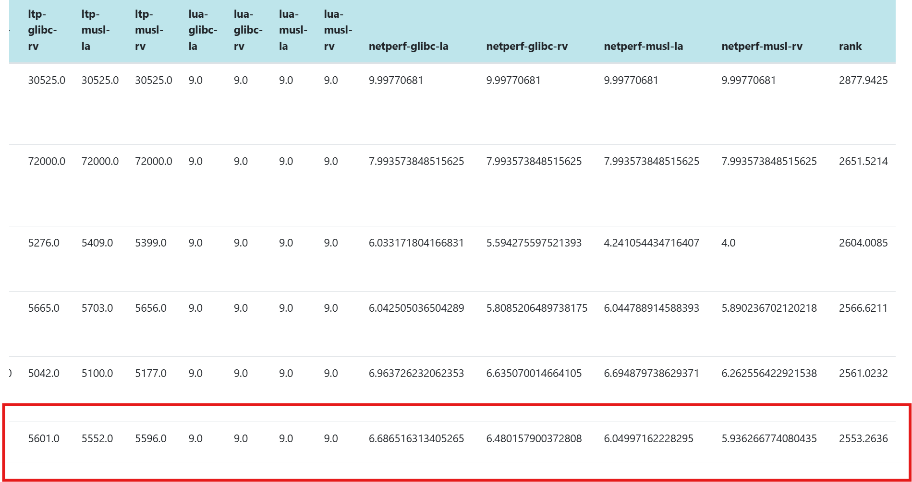
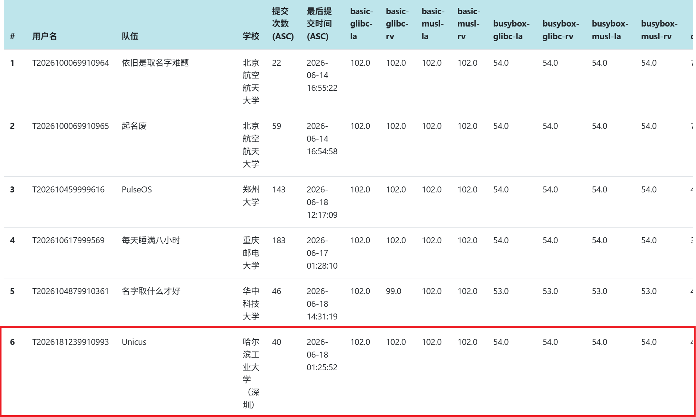
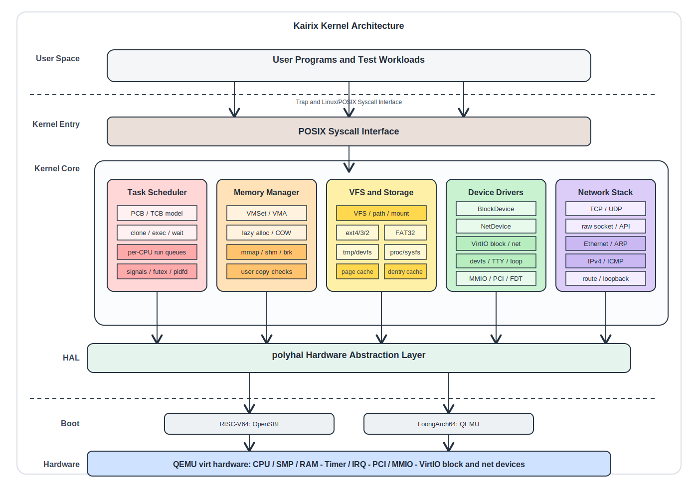

# Kairix

## 项目描述
**Kairix** 是由 团队开发的一款基于 Rust 语言，支持 RISC-V 和 LoongArch 架构的多核宏内核操作系统内核。

## 完成情况
### 初赛
Kairix已通过初赛大部分测试点，并在排行榜上位于前列：






### 功能介绍
*   **文件系统**
    提供类 Linux 的 VFS 架构，支持带 LRU 淘汰的 Dentry Cache 和统一 Page Cache。支持Ext4、FAT32 等磁盘文件系统，以及内存文件系统（tmpfs）、进程文件系统（procfs）。并具备较灵活的挂载管理能力。
*   **内存管理**
    基于缺页异常的动态内存映射技术，使用懒分配和copy_on_write策略，优化内存利用率，支持共享内存区域映射，便于高效资源共享。
*   **内存安全**
    完全由 Rust 语言实现，利用其所有权系统从根源消除缓冲区溢出和空指针异常。
*   **进程管理**
    支持多进程并发执行，每个进程都有自己的地址空间和资源，通过系统调用进行通信和资源管理。
*   **信号处理**
    实现了符合POSIX标准的信号系统，支持异步信号处理，支持用户自定义信号处理例程。
*   **设备驱动**
    复用一部分polyhal和DelOn1x的代码，支持MMIO（内存映射I/O）、PCI/ECAM设备探测、VirtIO块设备与VirtIO-net设备驱动。
*   **网络模块**
    实现了IPv4协议栈，支持ARP、ICMP、UDP、TCP以及RAW socket，提供TCP/UDP套接字通信接口，并支持本地回环设备（Loopback）和VirtIO-net网卡。
---

### 项目文档
- [初赛文档](./Unicus初赛文档.pdf)
- [初赛演示视频](https://pan.baidu.com/s/1V5s_lBLBU4_O8mLSbBfSrg?pwd=hrbf ):提取码：hrbf
- [初赛PPT](/workspace/Kairix初赛PPT.pdf)
## 运行方式
进入docker之后

**比赛环境**，可于os目录下（磁盘文件需要提供）
- 键入 `make all` 即可编译得到磁盘镜像以及内核可执行文件
- 键入 `make rkernel`即可编译执行riscv架构的内核。
- 键入 `make lkernel`即可编译执行loongarch架构的内核。

**终端**
支持 `ls``cd`内置指令
## 开发
### 目录结构
```
Kairix/
├── os/                  # 内核主体代码：进程、内存、VFS、网络、驱动、系统调用等
│   ├── src/
│   │   ├── main.rs      # 内核入口，完成初始化后进入任务调度
│   │   ├── config.rs    
│   │   ├── logging.rs   # 日志初始化
│   │   ├── console.rs   # 内核控制台输出封装
│   │   ├── error.rs     # 内核错误码与系统调用错误类型
│   │   ├── lang_items.rs # no_std panic/语言项支持
│   │   ├── timer.rs     # 时钟与定时器相关逻辑
│   │   ├── embedded.rs  # 启动时内置文件安装
│   │   ├── sbi.rs       # RISC-V SBI 调用封装
│   │   ├── sbi_la.rs    # LoongArch 固件调用封装
│   │   ├── entry.asm    # 早期汇编入口
│   │   ├── link_app.S   # 用户程序链接辅助
│   │   ├── linker-*.ld  # 各架构链接脚本
│   │   ├── arch/        # 架构相关代码，RV启动代码
│   │   ├── boards/      # 板级配置，当前主要面向 QEMU virt
│   │   ├── devices/     # 通用设备抽象
│   │   ├── drivers/     # 设备驱动，包含 VirtIO 块设备与 PCI 探测
│   │   ├── fs/          # 文件系统子系统
│   │   │   ├── vfs/     # VFS 抽象
│   │   │   ├── devfs/   # 设备文件系统
│   │   │   ├── procfs/  # proc 文件系统
│   │   │   ├── sysfs/   # sys 文件系统兼容节点
│   │   │   ├── tmpfs/   # 内存文件系统
│   │   │   ├── fat32/   # FAT32 文件系统适配
│   │   │   ├── lwext4/  # ext4 文件系统适配
│   │   │   ├── page/    # 页缓存
│   │   │   └── etc/     # /etc 下的内置配置文件
│   │   ├── mm/          # 内存管理
│   │   ├── net/         # 网络协议栈
│   │   ├── socket/      # socket 层
│   │   ├── sync/        # 同步原语
│   │   ├── syscall/     # 系统调用实现
│   │   ├── task/        # 进程/线程管理、调度器、PID、上下文切换
│   │   └── trap/        # trap/异常/中断处理入口与上下文
│   └── vendor/          # 内核构建使用的离线依赖
├── user/                # 用户态运行时库与测试/示例程序
│   ├── src/
│   │   ├── lib.rs       # 用户态运行时入口、堆初始化、系统调用安全封装
│   │   ├── syscall.rs   # 用户态系统调用号与 ecall/syscall 汇编封装
│   │   ├── console.rs   # 用户态 print/println 与输入输出辅助
│   │   ├── lang_items.rs # 用户态 no_std panic/语言项支持
│   │   ├── linker.ld    # 用户程序链接脚本
│   │   └── bin/         # 用户程序与测试入口
│   │       ├── initproc.rs             # 第一个用户进程
│   │       ├── user_shell.rs           # 简易 shell
│   │       ├── ls.rs                   # 目录查看工具
│   │       ├── ping.rs / ping2.rs      # 网络连通性测试
│   │       ├── tcp_test.rs / tcp_socket_test.rs # TCP/socket 测试
│   │       ├── usertests*.rs           # 用户态综合测试
│   │       ├── libctests_*.rs          # libc-test 启动入口
│   │       ├── libcbench.rs            # libc-bench 启动入口
│   │       └── hello_world.rs 等       # 基础示例与回归测试程序
│   └── vendor/          # 用户程序构建使用的离线依赖
├── polyhal/             # 多架构硬件抽象层
│   ├── polyhal/         # HAL 核心实现
│   │   └── src/
│   │       ├── lib.rs   # HAL crate 入口与公共导出
│   │       ├── arch/    # 架构相关模块选择与导出
│   │       ├── boards/  # 板级配置与设备树资源
│   │       ├── components/ # 等硬件组件抽象
│   │       ├── debug_console/ # 各架构调试控制台/UART输出
│   │       ├── pagetable/ # 页表抽象
│   │       ├── utils/   # 地址类型、percpu、无中断锁、宏等工具
│   │       ├── ctor.rs  # HAL 初始化阶段构造器
│   │       └── mem.rs   # DTB 解析与物理内存区域管理
│   ├── polyhal-boot/    # 启动入口与架构初始化
│   │   └── src/
│   │       ├── lib.rs   # arch_entry 宏入口与主核/从核启动转发
│   │       └── arch/    # LA启动代码
│   ├── polyhal-trap/    # trap/中断上下文抽象
│   │   └── src/
│   │       ├── lib.rs
│   │       ├── trap/    # 各架构 trap 入口、分发与返回逻辑
│   │       └── trapframe/ # 各架构 TrapFrame 寄存器保存结构
│   └── polyhal-macro/   # 架构相关过程宏
│       └── src/
│           └── lib.rs   
├── bootloader/          # RISC-V/LoongArch 启动固件
├── lwext4_rust/         # ext4 文件系统绑定与 lwext4 C 库
├── rust-fatfs/          # FAT/FAT32 文件系统实现
├── easy-fs/
├── easy-fs-fuse/
├── docs/
├── libc-test/
├── libc-bench/
├── iperf/
├── netperf-2.7.0/
├── tools/
├── patches/
├── judge/
├── .devcontainer/
├── .vscode/
├── Makefile
├── Dockerfile
├── rust-toolchain.toml
└── dev-env-info.md
```
## 注意事项
默认的路径是kairix，对应容器中挂载的workspace


## 贡献
欢迎提交Issue和Pull Request！

## 项目人员
哈尔滨工业大学（深圳）：

- 颜晨（邮箱TODO）
- 萧鹏（邮箱TODO）
- 雷鑫言（邮箱TODO）:内存管理，多架构设计和硬件抽象层
- 指导老师：夏文、仇洁婷

## 致谢
- [chronix](https://gitlab.eduxiji.net/educg-group-36002-2710490/T202518123995568-675):文件系统
- [polyhal](https://github.com/oscomp/polyhal):多架构硬件抽象层
- [rcore-os/rCore](https://github.com/rcore-os/rCore): 用户态程序
- [PhoenixOS](https://github.com/oscomp/first-prize-osk2024-phoenix)、 [MankorOS](https://gitlab.eduxiji.net/MankorOS/OSKernel2023-MankorOS): 设计文档

感谢所有为kairix项目做出贡献的开发者。
