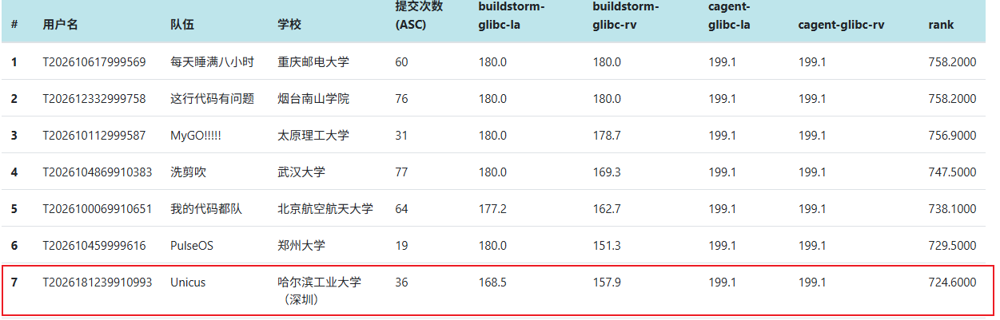
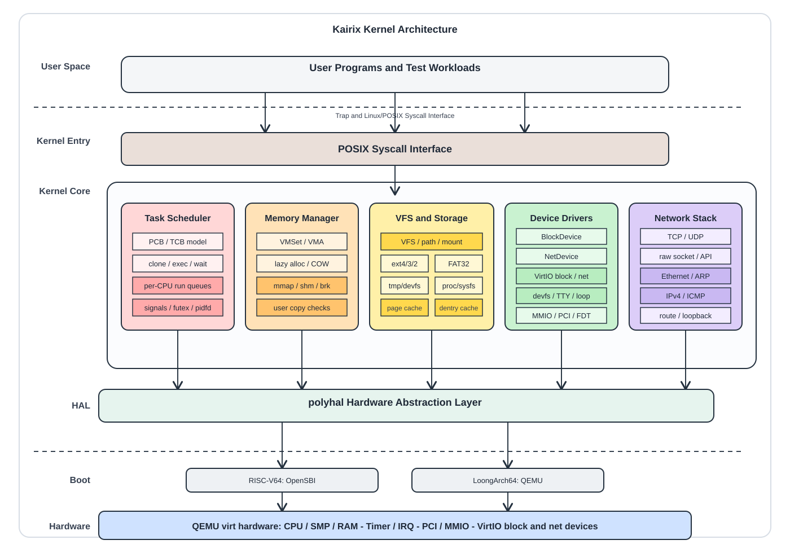

# Kairix

## 项目描述
**Kairix** 是由Unicus团队开发的一款基于Rust语言，支持RISC-V和LoongArch架构的多核宏内核操作系统内核。

## 完成情况
### 决赛
截止8月10日15时55分，Kairix已通过决赛大部分测试点，并在排行榜上位于前列：




### 功能介绍
*   **文件系统**
    提供类Linux的VFS架构，支持带LRU淘汰的Dentry Cache和统一Page Cache。支持Ext4、FAT32等磁盘文件系统，以及内存文件系统（tmpfs）、进程文件系统（procfs）。并具备较灵活的挂载管理能力。
*   **内存管理**
    基于缺页异常的动态内存映射技术，使用懒分配和copy_on_write策略，优化内存利用率，支持共享内存区域映射，便于高效资源共享。
*   **内存安全**
    完全由Rust语言实现，利用其所有权系统降低缓冲区溢出和空指针异常的风险。
*   **进程管理**
    支持多进程并发执行，每个进程都有自己的地址空间和资源，通过系统调用进行通信和资源管理。
*   **信号处理**
    实现了符合POSIX标准的信号系统，支持异步信号处理，支持用户自定义信号处理例程。
*   **设备驱动**
    复用一部分polyhal和DelOn1x的代码，支持MMIO（内存映射I/O）、PCI/ECAM设备探测、VirtIO块设备与VirtIO-net设备驱动。
*   **网络模块**
    自研网络栈、支持TCP UDP套接字、支持本地回环设备和IPv4协议栈。
---

### 项目文档
- [初赛文档](./Unicus初赛文档.pdf)
- [初赛演示视频](https://pan.baidu.com/s/1WML2KYY-YOFzeLGUteyLQQ?pwd=hk9w):提取码：hk9w
- [初赛PPT](./Unicus初赛PPT.pptx)
## 运行方式

进入docker之后

**比赛环境**，在项目顶层目录执行（磁盘镜像需要自行提供）：

- `make all`：编译 RISC-V 与 LoongArch 内核，并在对应磁盘镜像存在时写入用户程序。
- `make rkernel`：编译并运行 RISC-V 内核，不自动执行测试脚本，启动后进入交互终端。
- `make lkernel`：编译并运行 LoongArch 内核，不自动执行测试脚本，启动后进入交互终端。
- `make rkernel_test [AUTO_TEST=final|preliminary|off]`：编译并运行 RISC-V 比赛测试模式。
- `make lkernel_test [AUTO_TEST=final|preliminary|off]`：编译并运行 LoongArch 比赛测试模式。

`AUTO_TEST` 控制启动后的脚本执行模式：

- `final`：默认值，依次执行 `/musl/buildstorm_testcode.sh` 和 `/glibc/cagent_testcode.sh`，完成后关机。
- `preliminary`：执行原有初赛测试脚本列表，完成后关机。
- `off`：不执行测试脚本，进入交互终端。

例如：

```bash
# 默认执行 buildstorm 和 cagent
make lkernel_test

# 执行原初赛测试
make lkernel_test AUTO_TEST=preliminary

# 不执行脚本，进入交互终端
make lkernel_test AUTO_TEST=off
```

原有的 `AUTO_TEST=1` 和 `AUTO_TEST=0` 仍然兼容，分别等价于 `final` 和 `off`。直接执行 `qemu-system-*` 不会读取 Makefile 中的 `AUTO_TEST`；需要先通过上述 Makefile 目标将测试模式和新版 `initproc` 写入对应镜像。

## 开发
### 目录结构
```
Kairix/
├── os/                  # 内核主体代码
│   ├── src/
│   │   ├── main.rs      # 内核入口，完成初始化后进入任务调度
│   │   ├── config.rs
│   │   ├── logging.rs   # 日志初始化
│   │   ├── error.rs     # 内核错误码与系统调用错误类型
│   │   ├── lang_items.rs # no_std panic/语言项支持
│   │   ├── timer.rs     # 时钟与定时器相关逻辑
│   │   ├── interrupts.rs # 中断计数与/proc/interrupts支持
│   │   ├── embedded.rs  # 启动时内置文件安装
│   │   ├── ltp.rs       # LTP测试兼容辅助
│   │   ├── sbi.rs       # RISC-V SBI调用封装
│   │   ├── sbi_la.rs    # LoongArch固件调用封装
│   │   ├── link_app.S   # 用户程序链接辅助
│   │   ├── linker-*.ld  # RISC-V/LoongArch/QEMU链接脚本
│   │   ├── arch/        # 架构相关代码，包含RISC-V与LoongArch适配
│   │   ├── boards/      # 板级配置，包含QEMU virt、VisionFive 2与2K1000
│   │   ├── devices/     # 通用设备抽象
│   │   ├── drivers/     # 设备驱动，包含VirtIO、AHCI、VisionFive 2 SD与PCI探测
│   │   │   └── block/   # 块设备、分区、ramdisk及块读取缓存
│   │   ├── fs/          # 文件系统子系统
│   │   ├── mm/          # 内存管理
│   │   ├── net/         # 网络协议栈
│   │   │   └── virtio/  # VirtIO-net MMIO/PCI驱动
│   │   ├── socket/      # socket层
│   │   ├── security/    # 安全模块，当前包含Landlock
│   │   ├── ssh/         # 内核SSH服务
│   │   ├── sync/        # 同步原语
│   │   ├── syscall/     # 系统调用实现
│   │   │   ├── fs/      # 文件系统相关系统调用
│   │   │   └── signal/  # RISC-V与LoongArch信号处理
│   │   ├── task/        # 进程/线程管理、调度器、PID、上下文切换
│   │   └── trap/        # trap/异常/中断处理入口与上下文
│   ├── sunset/          # 内核SSH功能使用的no_std SSH/SFTP协议库
│   ├── .cargo/          # 内核crate本地Cargo配置
│   └── vendor/          # 内核构建使用的离线依赖
├── user/                # 用户态运行时库与测试/示例程序
│   ├── src/
│   │   ├── lib.rs       # 用户态运行时入口、堆初始化、系统调用安全封装
│   │   ├── syscall.rs   # 用户态系统调用号与ecall/syscall汇编封装
│   │   ├── console.rs   # 用户态print/println与输入输出辅助
│   │   ├── git.rs       # Git相关用户态辅助
│   │   ├── lang_items.rs # 用户态no_std panic/语言项支持
│   │   ├── linker.ld    # 用户程序链接脚本
│   │   └── bin/         # 用户程序与测试入口
│   ├── buildstorm_1.sh  # BuildStorm压力测试脚本
│   ├── .cargo/          # 用户程序crate本地Cargo配置
│   └── vendor/          # 用户程序构建使用的离线依赖
├── polyhal/             # 多架构硬件抽象层
│   ├── polyhal/         # HAL核心实现
│   ├── polyhal-boot/    # 启动入口与架构初始化
│   ├── polyhal-trap/    # trap/中断上下文抽象
│   ├── polyhal-macro/   # 架构相关过程宏
│   └── example/        
├── bootloader/          # 启动固件，当前包含rustsbi-qemu.bin
├── lwext4_rust/         # ext4文件系统绑定与lwext4 C库
├── rust-fatfs/          # FAT/FAT32文件系统实现（Git子模块，当前未展开）
├── easy-fs/             # 遗留构建目录，当前无有效源码
├── easy-fs-fuse/        # 遗留构建目录，当前无有效源码
├── iperf/               # iperf网络性能测试工具源码
├── netperf-2.7.0/       # netperf网络性能测试工具源码
├── tools/               # 镜像与文件系统工具
├── patches/             # 兼容补丁与移植补丁
├── docs/                # 项目文档、架构图与测试说明
├── .devcontainer/
├── .vscode/
├── Makefile
├── rust-toolchain.toml
├── AGENT.md
├── Unicus初赛文档.pdf
├── Unicus初赛PPT.pptx
├── README.md
```

## 贡献
欢迎提交Issue和Pull Request！

## 项目人员
哈尔滨工业大学（深圳）：

- 颜晨   1748323932@qq.com:文件系统，进程调度，异常机制。
- 萧鹏   2813498706@qq.com:信号、进程间通信、网络。
- 雷鑫言 250745208@qq.com: 内存管理，多架构设计和硬件抽象层。
- 指导老师：夏文、仇洁婷

## 致谢
- [Chronix](https://gitlab.eduxiji.net/educg-group-36002-2710490/T202518123995568-675):文件系统
- [polyhal](https://github.com/oscomp/polyhal)、[DelOn1x](https://github.com/Ya0rk/myOS/tree/main):多架构设计
- [rcore-os/rCore](https://github.com/rcore-os/rCore): 用户态程序
- [Titanix](https://gitlab.eduxiji.net/202318123101314/oskernel2023-Titanix): 锁
- [PhoenixOS](https://github.com/oscomp/first-prize-osk2024-phoenix)、 [Chronix](https://gitlab.eduxiji.net/educg-group-36002-2710490/T202518123995568-675)、[NighthawkOS](https://gitlab.eduxiji.net/T202518123995755/oskernel2025-nighthawkos): 设计文档

感谢所有为kairix项目做出贡献的开发者。
