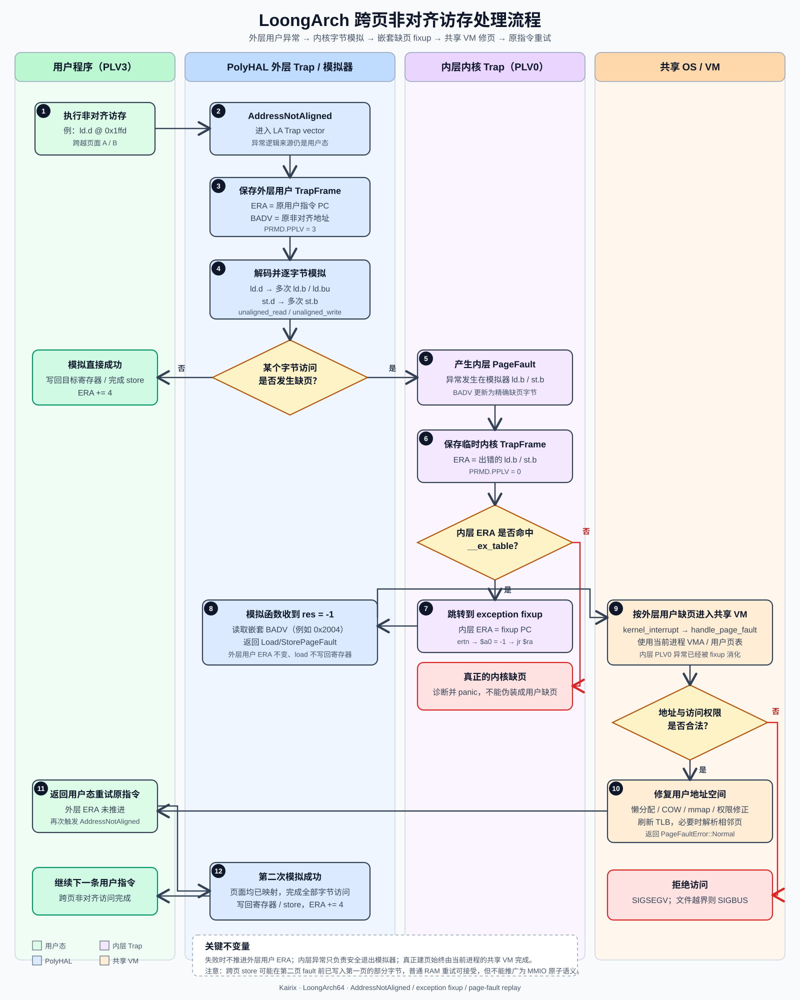

# LoongArch 跨页非对齐访存与缺页协同机制

本文整理 Kairix 在 LoongArch64 上对非对齐访存异常的处理，以及该路径如何与共享
虚拟内存、懒分配、COW、mmap 和用户信号处理协同工作。

本文特别区分两部分：

- 原始 PolyHAL 已经提供的非对齐指令解码和逐字节模拟器；
- Kairix 后续补充的 exception-table 恢复、嵌套缺页转换、跨页地址修复、VM 衔接和
  LS2K1000 实板兼容逻辑。

相关双架构总览见 [QEMU RV/LA 双架构设计](./qemu-rv-la-dual-arch-design.md)，LA
Trap 的整体控制流见 [Trap 处理流程](./Trap处理流程.md)。

## 1. 解决的问题

### 1.1 LoongArch 对非对齐访存产生异常

LoongArch 的普通整数 load/store 通常要求满足相应的自然对齐约束。例如一个 8 字节
`ld.d` 从 `0x1ffd` 开始，就会跨越两个页面：

```text
页面 A：0x1000 .. 0x1fff，已映射
页面 B：0x2000 .. 0x2fff，尚未映射

ld.d @ 0x1ffd
  0x1ffd 0x1ffe 0x1fff | 0x2000 0x2001 0x2002 0x2003 0x2004
         页面 A           |              页面 B
```

CPU 首先报告 `AddressNotAligned`。为了兼容 Linux 用户程序，内核不能简单地把它
当成非法访问，而需要模拟这条指令的实际读写效果。

### 1.2 模拟器本身会再次访问用户地址

非对齐模拟器运行在内核态，但它需要代替用户访问用户虚拟地址：

```asm
ld.b  $t3, $a0, 0
st.b  $t1, $a0, 0
```

如果模拟访问的某个字节所在页面没有映射，异常就变成了：

```text
用户态 AddressNotAligned
  -> 内核态 unaligned_read()/unaligned_write()
  -> 内核态 PageFault
```

普通内核缺页路径通常会把内核态缺页视为严重错误并 panic。因此必须把这个“内层
内核缺页”转换为外层用户任务可以处理的普通缺页。

### 1.3 跨页访问的地址不能使用原始 BADV

外层非对齐异常的 `BADV` 可能是 `0x1ffd`，但真正缺页的字节可能是 `0x2004`。
如果 VM 只处理 `0x1ffd` 所在的页面，页面 B 仍然没有映射，原指令重试后会再次
陷入，形成重复缺页循环。

### 1.4 QEMU 与 LS2K1000 的暴露方式不同

QEMU 往往可以完成部分跨页访问，或者只暴露一次异常；LS2K1000 对跨页访问和 TLB
pair 的行为更严格。仅依赖 QEMU 上能观察到的异常顺序，实板上仍可能重复 fault。

## 2. 相对原始 PolyHAL 的增量

原始 PolyHAL（仓库导入前指向 `Byte-OS/polyhal@3a3d578f`）已经包含：

- `AddressNotAligned` 分支；
- `emulate_load_store_insn()`；
- `unaligned_read()` / `unaligned_write()`；
- `ld.h/ld.w/ld.d/st.h/st.w/st.d` 等整数访存模拟；
- `FIXUP_EX` 宏和异常表项生成代码。

原始实现的主要限制是：模拟失败时 panic，Trap handler 固定把非对齐异常视为
`Unknown`，并且没有完整的 exception-table 查找和公共 VM 衔接。

Kairix 增量如下：

| 方面 | 原始 PolyHAL | 当前 Kairix |
| --- | --- | --- |
| 模拟成功 | 写回寄存器并推进 ERA | 保持原语义，返回 `Handled` |
| 模拟 load 缺页 | `panic!` | 返回 `LoadPageFault` |
| 模拟 store 缺页 | `panic!` | 返回 `StorePageFault` |
| 内层异常 | 没有运行时 fixup 消费者 | 查询 `__ex_table` 并跳到 fixup |
| 缺页地址 | 使用原始非对齐地址 | 使用嵌套异常的精确 `BADV` |
| VM 衔接 | 不可恢复 | 进入共享懒分配/COW/mmap 路径 |
| 跨页实板兼容 | 无 | 相邻页预解析和 TLB pair 恢复 |
| 不支持的指令 | panic | 返回 `IllegalInstruction` |

因此，项目新增的重点不是重新发明字节模拟器，而是把原有模拟器接入一个可恢复的
异常和虚拟内存闭环。

## 3. 总体时序

以 `ld.d` 从 `0x1ffd` 读取 8 字节为例，完整路径如下：



用于汇报或 PPT 的 16:9 精简版本见
[跨页非对齐访存流程图（PPT 精简版）](./loongarch-cross-page-unaligned-flow-ppt.svg)。

```text
用户执行非对齐 ld.d
        |
        v
外层 AddressNotAligned
        |
        v
保存用户 TrapFrame
ERA  = 原始用户指令地址
BADV = 0x1ffd
        |
        v
emulate_load_store_insn()
        |
        v
unaligned_read() 逐字节读取
        |
        +-- 访问 0x2004，页面 B 未映射
                |
                v
        内层内核态 PageFault
                |
                v
        exception-table 查找内层 ERA
                |
                v
        修改内层临时 TrapFrame.ERA 为 fixup
                |
                v
        ertn 到 fixup，返回 -1
        |
        v
读取嵌套 BADV = 0x2004
        |
        v
返回 TrapType::LoadPageFault(0x2004)
        |
        v
共享 VM 映射页面 B
        |
        v
用户 ERA 保持不变，重试原始 ld.d
        |
        v
第二次模拟成功，写回寄存器并 ERA += 4
        |
        v
返回用户态下一条指令
```

## 4. 外层非对齐异常

LA Trap handler 在 `ESTAT` 中识别 `AddressNotAligned`：

```rust
Trap::Exception(Exception::AddressNotAligned) => {
    unsafe { emulate_load_store_insn(tf) }
}
```

见 [loongarch64.rs:337](../polyhal/polyhal-trap/src/trap/loongarch64.rs#L337)。

此时 `tf` 是用户任务持久化的 TrapFrame，包含：

```text
tf.era  原始非对齐指令 PC
tf.regs 用户通用寄存器
tf.prmd 用户/特权级返回状态
BADV   非对齐访问地址
```

模拟器首先从 `tf.era` 读取 32 位 LA 指令，再根据 opcode 和寄存器字段选择对应的
模拟分支：

```rust
rd = (la_inst & 0x1f) as usize;
addr = badv::read().vaddr();
```

见 [unaligned.rs:140](../polyhal/polyhal-trap/src/trap/loongarch64/unaligned.rs#L140)。

当前主要覆盖：

- `LDH/LDHU/LDW/LDWU/LDD`；
- `STH/STW/STD`；
- `LDPTR*/STPTR*`；
- `LDX*/STX*` 整数扩展形式。

## 5. 逐字节模拟

### 5.1 读取

`unaligned_read()` 将多字节读取拆分为单字节读取：

```text
ld.d -> 8 次 ld.b/ld.bu
ld.w -> 4 次 ld.b/ld.bu
ld.h -> 2 次 ld.b/ld.bu
```

实现从高地址向低地址读取并移位组合：

```text
addr = addr + n - 1

循环：
  读取一个字节
  左移到目标位置
  OR 到临时 value
  addr -= 1
```

有符号读取在最高有效字节使用 `ld.b`，无符号读取使用 `ld.bu`，其余字节按无符号
字节组合。

实现见 [unaligned.rs:42](../polyhal/polyhal-trap/src/trap/loongarch64/unaligned.rs#L42)。

### 5.2 写入

`unaligned_write()` 将 store 拆为多个 `st.b`，从低地址向高地址写入：

```text
st.d -> 8 次 st.b
st.w -> 4 次 st.b
st.h -> 2 次 st.b
```

实现见 [unaligned.rs:86](../polyhal/polyhal-trap/src/trap/loongarch64/unaligned.rs#L86)。

### 5.3 成功和失败的 ERA 规则

只有所有字节访问成功后才执行：

```rust
pt_regs.era += 4;
TrapType::Handled
```

如果中途缺页：

```rust
return TrapType::LoadPageFault(...);
```

或：

```rust
return TrapType::StorePageFault(...);
```

此时不会推进用户 ERA，也不会把不完整的 load 结果写入目标寄存器。见
[unaligned.rs:162](../polyhal/polyhal-trap/src/trap/loongarch64/unaligned.rs#L162)。

## 6. 内层异常与 exception table

### 6.1 `FIXUP_EX` 生成的内容

模拟器中的用户地址访问通过宏登记异常恢复点：

```asm
FIXUP_EX 1, 6, 1
FIXUP_EX 2, 6, 0
FIXUP_EX 4, 6, 0
```

宏做两件事：

1. 在 `.fixup` 段生成恢复代码：

   ```asm
   6:
       li.w $a0, -1
       jr   $ra
   ```

2. 在 `__ex_table` 段生成：

   ```text
   fault_pc -> fixup_pc
   ```

见 [macros.rs:8](../polyhal/polyhal-trap/src/trap/loongarch64/macros.rs#L8)。

### 6.2 链接器保留表项

LA 链接脚本显式保留 `.fixup` 和 `__ex_table`：

```ld
KEEP(*(.fixup))

__ex_table_start = .;
KEEP(*(__ex_table))
__ex_table_end = .;
```

见 [linker-loongarch64.ld:10](../os/src/linker-loongarch64.ld#L10)。

### 6.3 内核态 Trap 恢复

内层异常进入 `trap_vector_base` 后，CPU 处于 PLV0，使用临时内核 TrapFrame。LA
handler 首先查询 exception table：

```rust
if tf.prmd & 0b11 == 0 {
    if let Some(fixup) = exception_fixup(tf.era) {
        tf.era = fixup;
        return TrapType::Handled;
    }
}
```

随后临时 TrapFrame 被恢复，`ertn` 跳到 fixup。fixup 将返回值设为 `-1`，于是控制
流回到 `unaligned_read()` 或 `unaligned_write()` 的调用点。

这个内层异常不会进入 OS 的普通缺页分支，因此不会被误判为不可恢复的内核缺页。

## 7. 精确传播嵌套缺页地址

第一次改造中，模拟器可以把原始地址直接返回：

```rust
TrapType::LoadPageFault(addr)
```

但跨页访问时 `addr` 可能仍然属于已映射的第一页。当前实现改为读取内层异常留下的
`BADV`：

```rust
fn emulation_fault_addr(original_addr: u64) -> usize {
    let nested_addr = badv::read().vaddr();
    if nested_addr == 0 {
        original_addr as usize
    } else {
        nested_addr
    }
}
```

见 [unaligned.rs:123](../polyhal/polyhal-trap/src/trap/loongarch64/unaligned.rs#L123)。

例如：

```text
原始非对齐地址：0x1ffd
模拟器真正 fault：0x2004
最终上报：       LoadPageFault(0x2004)
```

如果错误地上报 `0x1ffd`，VM 可能确认第一页已存在并返回成功，原指令重试后又在
第二页重复 fault，形成无限循环。

## 8. 接入共享 VM

LA 后端最终返回统一的 `TrapType`：

```text
TrapType::LoadPageFault(va)
TrapType::StorePageFault(va)
```

随后通过 `_interrupt_for_arch()` 进入共享内核：

```text
kernel_interrupt
  -> handle_page_fault
  -> handle_load_page_fault / handle_store_page_fault
  -> UserVMSet::handle_unalloc_page_fault
```

共享 VM 可以按普通用户缺页处理：

- 匿名页懒分配；
- 用户栈扩展；
- file-backed mmap；
- COW 写时复制；
- mprotect 后的 PTE 权限修复；
- 非法地址的 `SIGSEGV`；
- 文件映射越过 EOF 的 `SIGBUS`。

公共入口见 [os/src/trap/mod.rs:190](../os/src/trap/mod.rs#L190)。

如果缺页处理返回 `Normal`，外层用户 TrapFrame 的 ERA 仍然指向原始非对齐指令。任务
返回用户态后，原指令重新执行，第二次模拟即可访问已经建立的映射。

如果 VM 判断访问非法，则不重试原指令，而是进入同步信号或进程退出路径。

## 9. LS2K1000 实板兼容

### 9.1 相邻页预解析

在页面末尾附近发生 fault 时，VM 会尝试解析下一页：

```rust
if va.page_offset() > PAGE_SIZE - 32 {
    let next_va = VirtAddr::from((fault_vpn.0 + 1) * PAGE_SIZE);
    if self.find_area(next_va).is_some() {
        let _ = self.handle_unalloc_page_fault(next_va, access);
    }
}
```

见 [vm_set.rs:916](../os/src/mm/vm_set.rs#L916)。32 字节覆盖当前考虑的最大向量访问
宽度，避免 QEMU 和 LS2K1000 对第二页是否显式报告 fault 的差异影响重试。

### 9.2 已有 PTE 但 TLB 仍重复 fault

LS2K1000 可能出现页表中的 leaf PTE 已经存在，但 TLB 中仍保留无效或限制性 translation
的情况。恢复路径会：

```text
TLB::flush_all()
  -> 取偶数页和奇数页 PTE
  -> 构造 LoongArch 8 KiB pair
  -> tlbfill
```

这不是普通路径上的每次刷新，而是针对“PTE 已存在但重试仍 fault”的异常恢复兜底。

## 10. 正确性不变量

这条路径依赖以下不变量：

1. 内层异常只能在内核态且命中 exception table 时执行 fixup；
2. 模拟失败时不推进用户 ERA；
3. load 模拟失败时不写入目标寄存器；
4. 缺页地址优先使用嵌套异常的精确 `BADV`；
5. VM 修页后必须刷新对应的 LA TLB pair；
6. VM 失败时必须转入用户信号，而不是无限重试；
7. 模拟器成功后只推进一次 4 字节 LA 指令 PC。

## 11. 当前边界与风险

当前实现主要覆盖整数和指针访存。以下能力仍不是完整支持范围：

- 非对齐浮点 load/store 代码仍有注释分支；
- LSX/LASX 向量非对齐访存尚未作为普通模拟路径实现；
- 原子指令、LL/SC 的非对齐语义未覆盖；
- store 在跨页失败前可能已经写入第一页的部分字节；
- 因此该机制应主要用于普通用户 RAM，不应直接推广到有副作用的 MMIO；
- 当前实板 TLB 恢复路径仍包含 LA 专属代码，尚未完全抽象到 PolyHAL。

特别是跨页 store：

```text
写入第一页部分字节
  -> 写入第二页时 fault
  -> 修复第二页
  -> 重试整条 store
```

普通 RAM 中重复写相同值通常可接受，但这不等价于对任意设备地址提供原子写语义。

## 12. 关键源码与历史

| 内容 | 文件/提交 |
| --- | --- |
| LA 非对齐 Trap 分发 | `polyhal/polyhal-trap/src/trap/loongarch64.rs` |
| 字节读写模拟 | `polyhal/polyhal-trap/src/trap/loongarch64/unaligned.rs` |
| `FIXUP_EX` 宏 | `polyhal/polyhal-trap/src/trap/loongarch64/macros.rs` |
| exception table 链接布局 | `os/src/linker-loongarch64.ld` |
| 公共缺页入口 | `os/src/trap/mod.rs` |
| VM 相邻页/TLB 兜底 | `os/src/mm/vm_set.rs` |
| exception table 与 Trap 衔接 | `603da05a` |
| 精确嵌套 BADV 修复 | `fb8d4877` / `85c11237` |
| LS2K1000 跨页/TLB 兜底 | `42f31858` |
| LSX TrapFrame 偏移适配 | `e52a8139` |

## 13. 工作总结

针对原始 PolyHAL 在 LoongArch 非对齐访存模拟过程中遇到跨页访问会触发内核 panic、
无法进入正常缺页处理的问题，Kairix 在原有逐字节模拟器基础上补充了 exception table
的链接保留、运行时查找和内核态异常 fixup，将模拟失败从 panic 改为统一的
`LoadPageFault/StorePageFault`，并通过嵌套异常留下的精确 `BADV` 将真正缺页地址传递给
共享 VM。页面修复后，用户 ERA 保持不变并重放原始指令；同时针对 LS2K1000 增加了相邻
页预解析和 TLB pair 恢复逻辑。最终，LoongArch 非对齐访存可以复用 Kairix 的懒分配、
COW、mmap 和信号处理路径，避免跨页访问导致的内核崩溃和重复缺页死循环。

本文基于源码和 Git 历史静态整理，未在本次整理过程中启动 QEMU、内核或修改镜像。
